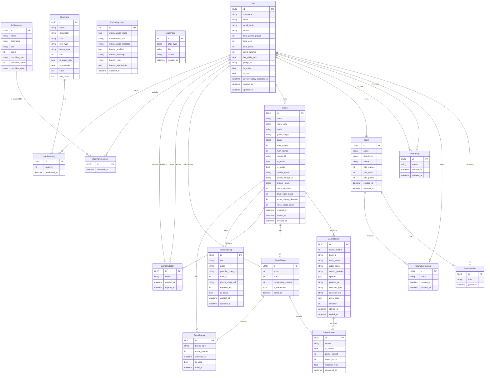
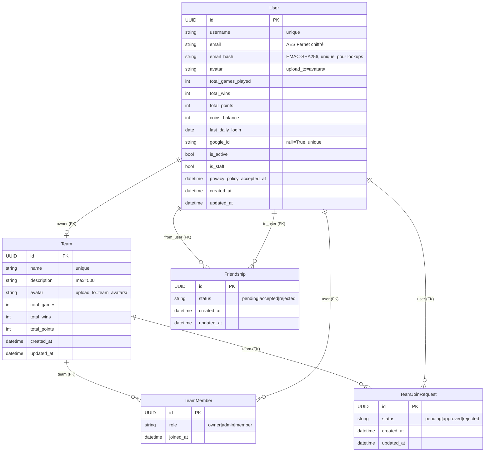
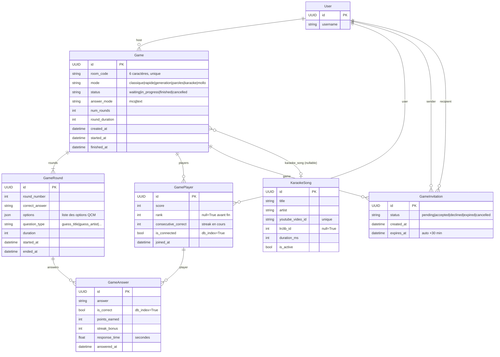
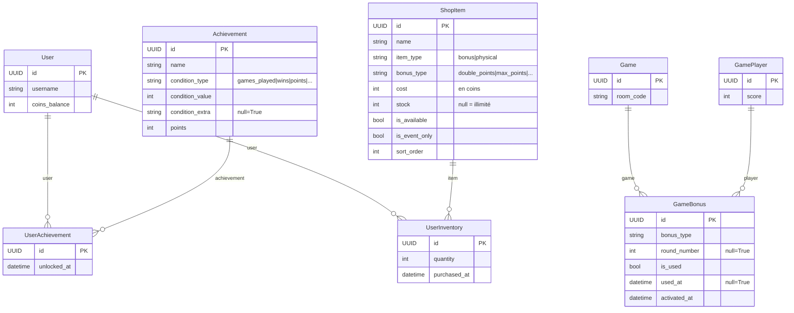
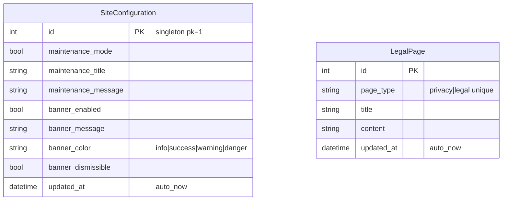

# MCD — Modèles et Relations — InstantMusic

> Diagrammes Mermaid des relations entre modèles et documentation détaillée de chaque modèle Django du projet.

---

## Table des matières

- [MCD — Modèles et Relations — InstantMusic](#mcd--modèles-et-relations--instantmusic)
  - [Table des matières](#table-des-matières)
  - [Diagramme ER global](#diagramme-er-global)
  - [Diagrammes par domaine](#diagrammes-par-domaine)
    - [Domaine Users](#domaine-users)
    - [Domaine Games](#domaine-games)
    - [Domaine Achievements et Shop](#domaine-achievements-et-shop)
    - [Domaine Administration](#domaine-administration)
  - [Documentation des modèles](#documentation-des-modèles)
    - [`apps.users`](#appsusers)
      - [`User`](#user)
      - [`Team`](#team)
      - [`TeamMember`](#teammember)
      - [`TeamJoinRequest`](#teamjoinrequest)
      - [`Friendship`](#friendship)
    - [`apps.games`](#appsgames)
      - [`Game`](#game)
      - [`GameRound`](#gameround)
      - [`GamePlayer`](#gameplayer)
      - [`GameAnswer`](#gameanswer)
      - [`GameInvitation`](#gameinvitation)
      - [`KaraokeSong`](#karaokesong)
    - [`apps.achievements`](#appsachievements)
      - [`Achievement`](#achievement)
      - [`UserAchievement`](#userachievement)
    - [`apps.administration`](#appsadministration)
      - [`SiteConfiguration` — Singleton](#siteconfiguration--singleton)
      - [`LegalPage`](#legalpage)
    - [`apps.shop`](#appsshop)
      - [`ShopItem`](#shopitem)
      - [`UserInventory`](#userinventory)
      - [`GameBonus`](#gamebonus)
  - [Résumé des contraintes d'intégrité](#résumé-des-contraintes-dintégrité)

---

## Diagramme ER global



---

## Diagrammes par domaine

### Domaine Users



**Contraintes d'unicité :**
- `TeamMember` : unique sur `(team, user)`
- `TeamJoinRequest` : unique sur `(team, user)`
- `Friendship` : unique sur `(from_user, to_user)`

### Domaine Games



**Contraintes d'unicité :**
- `GameRound` : unique sur `(game, round_number)`
- `GamePlayer` : unique sur `(game, user)`
- `GameAnswer` : unique sur `(round, player)`
- `GameInvitation` : unique sur `(game, recipient)`

### Domaine Achievements et Shop



### Domaine Administration



---

## Documentation des modèles

### `apps.users`

---

#### `User`

Modèle utilisateur custom qui remplace `django.contrib.auth.models.AbstractUser`. Utilise des UUID comme clés primaires pour éviter l'énumération.

| Champ                        | Type                  | Contraintes                      | Description                             |
| ---------------------------- | --------------------- | -------------------------------- | --------------------------------------- |
| `id`                         | `UUIDField`           | PK, default=uuid4                | Identifiant unique universel            |
| `username`                   | `CharField(150)`      | unique, index                    | Nom d'utilisateur public                |
| `email`                      | `EncryptedEmailField` | —                                | Email chiffré AES Fernet en base        |
| `email_hash`                 | `CharField(64)`       | unique, index                    | HMAC-SHA256 de l'email pour les lookups |
| `avatar`                     | `ImageField`          | upload_to="avatars/", blank=True | Photo de profil                         |
| `total_games_played`         | `IntegerField`        | default=0                        | Compteur agrégé de parties              |
| `total_wins`                 | `IntegerField`        | default=0                        | Compteur agrégé de victoires            |
| `total_points`               | `IntegerField`        | default=0                        | Total de points cumulés                 |
| `coins_balance`              | `IntegerField`        | default=0                        | Solde de coins virtuels                 |
| `last_daily_login`           | `DateField`           | null=True                        | Pour le bonus de connexion quotidienne  |
| `google_id`                  | `CharField(255)`      | null=True, unique                | ID Google OAuth                         |
| `is_active`                  | `BooleanField`        | default=True                     | Compte actif                            |
| `is_staff`                   | `BooleanField`        | default=False                    | Accès admin Django                      |
| `privacy_policy_accepted_at` | `DateTimeField`       | null=True                        | Date d'acceptation RGPD                 |
| `created_at`                 | `DateTimeField`       | auto_now_add                     | Date de création                        |
| `updated_at`                 | `DateTimeField`       | auto_now                         | Date de mise à jour                     |

**Propriété calculée :**
```python
@property
def win_rate(self) -> float:
    """Retourne le taux de victoires en pourcentage (0.0 à 100.0)."""
    if self.total_games_played == 0:
        return 0.0
    return round(self.total_wins / self.total_games_played * 100, 1)
```

**Chiffrement de l'email :**
```python
# Le champ EncryptedEmailField surcharge get() et save()
# pour chiffrer/déchiffrer transparemment.
# La recherche par email passe toujours par email_hash :

user = User.objects.get(email_hash=make_email_hash("alice@example.com"))
```

---

#### `Team`

Groupe de joueurs pouvant participer ensemble.

| Champ          | Type                    | Contraintes                | Description                       |
| -------------- | ----------------------- | -------------------------- | --------------------------------- |
| `id`           | `UUIDField`             | PK                         | Identifiant unique                |
| `name`         | `CharField(100)`        | unique                     | Nom de l'équipe                   |
| `description`  | `TextField`             | max_length=500, blank=True | Description                       |
| `avatar`       | `ImageField`            | upload_to="team_avatars/"  | Logo de l'équipe                  |
| `owner`        | `ForeignKey(User)`      | CASCADE                    | Propriétaire de l'équipe          |
| `members`      | `ManyToManyField(User)` | through=TeamMember         | Membres (via table intermédiaire) |
| `total_games`  | `IntegerField`          | default=0                  | Stats agrégées                    |
| `total_wins`   | `IntegerField`          | default=0                  | Stats agrégées                    |
| `total_points` | `IntegerField`          | default=0                  | Stats agrégées                    |
| `created_at`   | `DateTimeField`         | auto_now_add               | —                                 |
| `updated_at`   | `DateTimeField`         | auto_now                   | —                                 |

---

#### `TeamMember`

Table intermédiaire pour la relation `Team ↔ User` avec rôle.

| Champ       | Type               | Contraintes  | Description                |
| ----------- | ------------------ | ------------ | -------------------------- |
| `id`        | `UUIDField`        | PK           | —                          |
| `team`      | `ForeignKey(Team)` | CASCADE      | Équipe                     |
| `user`      | `ForeignKey(User)` | CASCADE      | Membre                     |
| `role`      | `CharField`        | choices      | `owner`, `admin`, `member` |
| `joined_at` | `DateTimeField`    | auto_now_add | Date d'adhésion            |

Contrainte : `unique_together = [("team", "user")]`

---

#### `TeamJoinRequest`

Demande d'adhésion d'un utilisateur à une équipe. Un administrateur de l'équipe peut l'approuver ou la rejeter.

| Champ        | Type               | Contraintes  | Description                       |
| ------------ | ------------------ | ------------ | --------------------------------- |
| `id`         | `UUIDField`        | PK           | —                                 |
| `team`       | `ForeignKey(Team)` | CASCADE      | Équipe ciblée                     |
| `user`       | `ForeignKey(User)` | CASCADE      | Demandeur                         |
| `status`     | `CharField`        | choices      | `pending`, `approved`, `rejected` |
| `created_at` | `DateTimeField`    | auto_now_add | —                                 |
| `updated_at` | `DateTimeField`    | auto_now     | —                                 |

Contrainte : `unique_together = [("team", "user")]`

---

#### `Friendship`

Relation d'amitié directionnelle. Une amitié `(A→B)` et `(B→A)` sont deux enregistrements distincts mais l'unicité empêche les doublons.

| Champ        | Type               | Contraintes                                  | Description                       |
| ------------ | ------------------ | -------------------------------------------- | --------------------------------- |
| `id`         | `UUIDField`        | PK                                           | —                                 |
| `from_user`  | `ForeignKey(User)` | CASCADE, related_name="friendships_sent"     | Initiateur                        |
| `to_user`    | `ForeignKey(User)` | CASCADE, related_name="friendships_received" | Destinataire                      |
| `status`     | `CharField`        | choices                                      | `pending`, `accepted`, `rejected` |
| `created_at` | `DateTimeField`    | auto_now_add                                 | —                                 |
| `updated_at` | `DateTimeField`    | auto_now                                     | —                                 |

Contrainte : `unique_together = [("from_user", "to_user")]`

---

### `apps.games`

---

#### `Game`

Représente une partie de quiz. La `room_code` est un identifiant court (6 caractères) partagé avec les joueurs pour rejoindre.

| Champ                    | Type                      | Contraintes         | Description                                                        |
| ------------------------ | ------------------------- | ------------------- | ------------------------------------------------------------------ |
| `id`                     | `UUIDField`               | PK                  | —                                                                  |
| `name`                   | `CharField(100)`          | blank=True          | Nom optionnel donné par l'hôte                                     |
| `room_code`              | `CharField(6)`            | unique              | Code de salle (ex: "AB1C2D")                                       |
| `host`                   | `ForeignKey(User)`        | CASCADE             | Hôte de la partie                                                  |
| `mode`                   | `CharField`               | choices             | `classique`, `rapide`, `generation`, `paroles`, `karaoke`, `mollo` |
| `guess_target`           | `CharField`               | choices             | `title` ou `artist` (ce qu'on doit deviner)                        |
| `status`                 | `CharField`               | choices, db_index   | `waiting`, `in_progress`, `finished`, `cancelled`                  |
| `max_players`            | `IntegerField`            | default=8           | Limite de joueurs                                                  |
| `num_rounds`             | `IntegerField`            | default=10          | Nombre de rounds                                                   |
| `playlist_id`            | `CharField(255)`          | null=True           | ID de la playlist Deezer                                           |
| `is_online`              | `BooleanField`            | —                   | Partie en ligne ou locale                                          |
| `is_public`              | `BooleanField`            | db_index            | Visible dans la liste publique                                     |
| `playlist_name`          | `CharField(255)`          | blank=True          | Nom de la playlist (cache)                                         |
| `playlist_image_url`     | `URLField`                | blank=True          | Image de la playlist (cache)                                       |
| `answer_mode`            | `CharField`               | choices             | `mcq` (QCM) ou `text` (saisie libre)                               |
| `round_duration`         | `IntegerField`            | default=30          | Durée d'un round en secondes                                       |
| `timer_start_round`      | `IntegerField`            | default=5           | Compte à rebours avant le round                                    |
| `score_display_duration` | `IntegerField`            | default=10          | Durée d'affichage des scores                                       |
| `lyrics_words_count`     | `IntegerField`            | default=3           | Mots à compléter en mode paroles                                   |
| `karaoke_song`           | `ForeignKey(KaraokeSong)` | SET_NULL, null=True | Chanson en mode karaoké                                            |
| `created_at`             | `DateTimeField`           | auto_now_add        | —                                                                  |
| `started_at`             | `DateTimeField`           | null=True           | Début effectif de la partie                                        |
| `finished_at`            | `DateTimeField`           | null=True           | Fin de la partie                                                   |

---

#### `GameRound`

Un round = une piste musicale à deviner. Les `options` sont précalculées lors de la génération.

| Champ            | Type               | Contraintes           | Description                            |
| ---------------- | ------------------ | --------------------- | -------------------------------------- |
| `id`             | `UUIDField`        | PK                    | —                                      |
| `game`           | `ForeignKey(Game)` | CASCADE               | Partie parente                         |
| `round_number`   | `IntegerField`     | —                     | Numéro de 1 à `num_rounds`             |
| `track_id`       | `CharField(255)`   | —                     | ID Deezer de la piste                  |
| `track_name`     | `CharField(255)`   | —                     | Titre de la chanson                    |
| `artist_name`    | `CharField(255)`   | —                     | Nom de l'artiste                       |
| `correct_answer` | `CharField(255)`   | —                     | La bonne réponse                       |
| `options`        | `JSONField`        | default=list          | Liste des 4 options QCM                |
| `preview_url`    | `URLField(500)`    | —                     | URL de l'extrait audio 30s             |
| `question_type`  | `CharField(30)`    | default="guess_title" | Type de question                       |
| `question_text`  | `CharField(500)`   | —                     | Texte affiché au joueur                |
| `extra_data`     | `JSONField`        | default=dict          | Données additionnelles (paroles, sync) |
| `duration`       | `IntegerField`     | default=30            | Durée du round en secondes             |
| `started_at`     | `DateTimeField`    | null=True             | Début effectif du round                |
| `ended_at`       | `DateTimeField`    | null=True             | Fin du round                           |

Contrainte : `unique_together = [("game", "round_number")]`

**Champ `extra_data` selon le mode :**
```json
// Mode paroles
{
  "lyrics_snippet": "Never gonna ___ you up",
  "missing_words": ["give"],
  "full_lyrics_preview": "We're no strangers to love..."
}

// Mode karaoké
{
  "youtube_video_id": "dQw4w9WgXcQ",
  "lrc_lines": [
    { "time": 18.5, "text": "Never gonna give you up" },
    { "time": 20.1, "text": "Never gonna let you down" }
  ],
  "start_offset_ms": 45000
}

// Mode génération
{
  "release_year": 1987,
  "decade": "1980s"
}
```

---

#### `GamePlayer`

Participation d'un utilisateur à une partie. Agrège le score et maintient le streak.

| Champ                 | Type               | Contraintes            | Description                      |
| --------------------- | ------------------ | ---------------------- | -------------------------------- |
| `id`                  | `UUIDField`        | PK                     | —                                |
| `game`                | `ForeignKey(Game)` | CASCADE                | Partie                           |
| `user`                | `ForeignKey(User)` | CASCADE                | Joueur                           |
| `score`               | `IntegerField`     | default=0              | Score total de la partie         |
| `rank`                | `IntegerField`     | null=True              | Rang final (défini à la fin)     |
| `consecutive_correct` | `IntegerField`     | default=0              | Streak de bonnes réponses actuel |
| `is_connected`        | `BooleanField`     | default=True, db_index | Connexion WebSocket active       |
| `joined_at`           | `DateTimeField`    | auto_now_add           | —                                |

Contrainte : `unique_together = [("game", "user")]`

---

#### `GameAnswer`

Réponse soumise par un joueur à un round spécifique.

| Champ           | Type                     | Contraintes  | Description                  |
| --------------- | ------------------------ | ------------ | ---------------------------- |
| `id`            | `UUIDField`              | PK           | —                            |
| `round`         | `ForeignKey(GameRound)`  | CASCADE      | Round concerné               |
| `player`        | `ForeignKey(GamePlayer)` | CASCADE      | Joueur                       |
| `answer`        | `CharField(255)`         | —            | Réponse soumise (texte brut) |
| `is_correct`    | `BooleanField`           | db_index     | Réponse correcte ou non      |
| `points_earned` | `IntegerField`           | —            | Points calculés              |
| `streak_bonus`  | `IntegerField`           | default=0    | Bonus de streak appliqué     |
| `response_time` | `FloatField`             | —            | Temps de réponse en secondes |
| `answered_at`   | `DateTimeField`          | auto_now_add | —                            |

Contrainte : `unique_together = [("round", "player")]`

---

#### `GameInvitation`

Invitation envoyée par l'hôte d'une partie à un ami. Expire automatiquement après 30 minutes.

| Champ        | Type               | Contraintes                                  | Description                                               |
| ------------ | ------------------ | -------------------------------------------- | --------------------------------------------------------- |
| `id`         | `UUIDField`        | PK                                           | —                                                         |
| `game`       | `ForeignKey(Game)` | CASCADE                                      | Partie concernée                                          |
| `sender`     | `ForeignKey(User)` | CASCADE, related_name="sent_invitations"     | Hôte                                                      |
| `recipient`  | `ForeignKey(User)` | CASCADE, related_name="received_invitations" | Destinataire                                              |
| `status`     | `CharField`        | choices                                      | `pending`, `accepted`, `declined`, `expired`, `cancelled` |
| `created_at` | `DateTimeField`    | auto_now_add                                 | —                                                         |
| `expires_at` | `DateTimeField`    | —                                            | `created_at + 30 minutes` (calculé auto)                  |

Contrainte : `unique_together = [("game", "recipient")]`

**Propriété calculée :**
```python
@property
def is_expired(self) -> bool:
    return timezone.now() > self.expires_at
```

---

#### `KaraokeSong`

Chanson disponible en mode karaoké. Les paroles synchronisées proviennent de l'API LRCLib.

| Champ              | Type             | Contraintes  | Description                         |
| ------------------ | ---------------- | ------------ | ----------------------------------- |
| `id`               | `UUIDField`      | PK           | —                                   |
| `title`            | `CharField(255)` | —            | Titre de la chanson                 |
| `artist`           | `CharField(255)` | —            | Artiste                             |
| `youtube_video_id` | `CharField(20)`  | unique       | ID de la vidéo YouTube              |
| `lrclib_id`        | `IntegerField`   | null=True    | ID dans l'API LRCLib (paroles sync) |
| `album_image_url`  | `URLField`       | blank=True   | Pochette de l'album                 |
| `duration_ms`      | `IntegerField`   | default=0    | Durée en millisecondes              |
| `is_active`        | `BooleanField`   | default=True | Disponible pour les parties         |
| `created_at`       | `DateTimeField`  | auto_now_add | —                                   |
| `updated_at`       | `DateTimeField`  | auto_now     | —                                   |

---

### `apps.achievements`

---

#### `Achievement`

Définition d'un succès. Les 40+ succès sont créés via la commande `seed_achievements`.

| Champ             | Type             | Contraintes               | Description                               |
| ----------------- | ---------------- | ------------------------- | ----------------------------------------- |
| `id`              | `UUIDField`      | PK                        | —                                         |
| `name`            | `CharField(100)` | —                         | Nom affiché                               |
| `description`     | `TextField`      | —                         | Description de la condition               |
| `icon`            | `ImageField`     | upload_to="achievements/" | Icône du badge                            |
| `points`          | `IntegerField`   | default=10                | Points bonus à l'obtention                |
| `condition_type`  | `CharField(50)`  | —                         | Type de condition (voir liste ci-dessous) |
| `condition_value` | `IntegerField`   | —                         | Valeur numérique de la condition          |
| `condition_extra` | `CharField(100)` | null=True                 | Paramètre additionnel (ex: nom du mode)   |

**Types de condition (`condition_type`) :**

```
games_played      → condition_value = nombre de parties requises
wins              → condition_value = nombre de victoires requises
points            → condition_value = total de points requis
perfect_round     → condition_value = nombre de rounds parfaits
streak            → condition_value = longueur de la série
first_win         → condition_value = 1 (toujours)
daily_login       → condition_value = jours consécutifs
mode_specific     → condition_value = nb victoires, condition_extra = mode
speed             → condition_value = secondes max de réponse
coins             → condition_value = coins accumulés
```

---

#### `UserAchievement`

Lien entre un utilisateur et un succès qu'il a débloqué.

| Champ         | Type                      | Contraintes  | Description       |
| ------------- | ------------------------- | ------------ | ----------------- |
| `id`          | `UUIDField`               | PK           | —                 |
| `user`        | `ForeignKey(User)`        | CASCADE      | Utilisateur       |
| `achievement` | `ForeignKey(Achievement)` | CASCADE      | Succès débloqué   |
| `unlocked_at` | `DateTimeField`           | auto_now_add | Date de déblocage |

Contrainte : `unique_together = [("user", "achievement")]`

---

### `apps.administration`

---

#### `SiteConfiguration` — Singleton

Un seul enregistrement en base (pk=1). Modifiable depuis l'interface admin Jazzmin.

| Champ                 | Type                  | Description                                       |
| --------------------- | --------------------- | ------------------------------------------------- |
| `maintenance_mode`    | `BooleanField(False)` | Active le `MaintenanceMiddleware` (503 pour tous) |
| `maintenance_title`   | `CharField(200)`      | Titre de la page de maintenance                   |
| `maintenance_message` | `TextField`           | Message affiché aux utilisateurs                  |
| `banner_enabled`      | `BooleanField(False)` | Affiche la bannière sur le frontend               |
| `banner_message`      | `CharField(500)`      | Contenu de la bannière                            |
| `banner_color`        | `CharField`           | `info`, `success`, `warning`, `danger`            |
| `banner_dismissible`  | `BooleanField(True)`  | Permet de fermer la bannière                      |
| `updated_at`          | `DateTimeField`       | auto_now (horodatage de la dernière modif)        |

---

#### `LegalPage`

Pages légales modifiables depuis l'admin. Maximum 2 enregistrements (`privacy` et `legal`).

| Champ        | Type                 | Description                        |
| ------------ | -------------------- | ---------------------------------- |
| `page_type`  | `CharField` (unique) | `privacy` ou `legal`               |
| `title`      | `CharField(200)`     | Titre de la page                   |
| `content`    | `TextField`          | Contenu complet (Markdown ou HTML) |
| `updated_at` | `DateTimeField`      | auto_now                           |

---

### `apps.shop`

---

#### `ShopItem`

Article disponible à l'achat dans la boutique virtuelle.

| Champ           | Type             | Contraintes       | Description                                |
| --------------- | ---------------- | ----------------- | ------------------------------------------ |
| `id`            | `UUIDField`      | PK                | —                                          |
| `name`          | `CharField(100)` | —                 | Nom de l'article                           |
| `description`   | `TextField`      | —                 | Description et effets                      |
| `icon`          | `ImageField`     | upload_to="shop/" | Icône de l'article                         |
| `item_type`     | `CharField`      | choices           | `bonus` ou `physical`                      |
| `bonus_type`    | `CharField`      | choices           | Type de bonus (8 valeurs possibles)        |
| `cost`          | `IntegerField`   | —                 | Prix en coins                              |
| `is_event_only` | `BooleanField`   | default=False     | Disponible uniquement pendant un événement |
| `is_available`  | `BooleanField`   | default=True      | Visible et achetable                       |
| `stock`         | `IntegerField`   | null=True         | `null` = stock illimité                    |
| `sort_order`    | `IntegerField`   | default=0         | Ordre d'affichage dans la boutique         |

---

#### `UserInventory`

Inventaire des articles possédés par un utilisateur.

| Champ          | Type                   | Contraintes  | Description           |
| -------------- | ---------------------- | ------------ | --------------------- |
| `id`           | `UUIDField`            | PK           | —                     |
| `user`         | `ForeignKey(User)`     | CASCADE      | Propriétaire          |
| `item`         | `ForeignKey(ShopItem)` | CASCADE      | Article               |
| `quantity`     | `IntegerField`         | default=1    | Quantité possédée     |
| `purchased_at` | `DateTimeField`        | auto_now_add | Date du dernier achat |

Contrainte : `unique_together = [("user", "item")]`

---

#### `GameBonus`

Bonus activé par un joueur pendant une partie. Un bonus activé mais pas encore utilisé attend le bon moment (round spécifique ou prochain round).

| Champ          | Type                     | Contraintes   | Description                         |
| -------------- | ------------------------ | ------------- | ----------------------------------- |
| `id`           | `UUIDField`              | PK            | —                                   |
| `game`         | `ForeignKey(Game)`       | CASCADE       | Partie concernée                    |
| `player`       | `ForeignKey(GamePlayer)` | CASCADE       | Joueur qui active le bonus          |
| `bonus_type`   | `CharField`              | choices       | Type de bonus (8 valeurs)           |
| `round_number` | `IntegerField`           | null=True     | Round cible (null = prochain round) |
| `activated_at` | `DateTimeField`          | auto_now_add  | Moment d'activation                 |
| `is_used`      | `BooleanField`           | default=False | Bonus consommé                      |
| `used_at`      | `DateTimeField`          | null=True     | Moment de consommation              |

---

## Résumé des contraintes d'intégrité

```
Modèle              Contrainte unique_together
──────────────────────────────────────────────
TeamMember          (team, user)
TeamJoinRequest     (team, user)
Friendship          (from_user, to_user)
GameRound           (game, round_number)
GamePlayer          (game, user)
GameAnswer          (round, player)
GameInvitation      (game, recipient)
UserAchievement     (user, achievement)
UserInventory       (user, item)
```

```
Modèle              Champs avec index de base de données
────────────────────────────────────────────────────────
Game                status (db_index), is_public (db_index)
GamePlayer          is_connected (db_index)
GameAnswer          is_correct (db_index)
User                username (unique → index auto)
                    email_hash (unique → index auto)
                    google_id (unique → index auto)
KaraokeSong         youtube_video_id (unique → index auto)
```

---

> Voir aussi :
> - [01-structure.md](./01-structure.md) — Structure des dossiers et configuration
> - [02-apps.md](./02-apps.md) — Rôle détaillé de chaque application Django
> - [04-api-routes.md](./04-api-routes.md) — Référence complète des routes API
